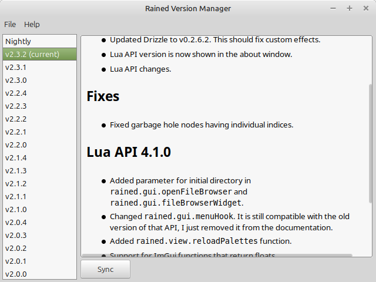

# Rained Version Manager
Version manager for [Rained](https://github.com/pkhead/Rained)

<p align="center">

</p>

> [!note]
> If attempting to run the executable fails, you might need to install the
> [Microsoft Visual C++ Redistributable](https://aka.ms/vs/17/release/vc_redist.x64.exe)
>
> For Linux users, the prebuilt binary was built in Linux Mint 22.1 Cinnamon,
> meaning that it only works on Debian/Ubuntu-based distributions. Additionally,
> you must have GTK3 installed.

## Building
Prerequisities:
- C and C++17 compiler 
- Meson build system
- [wxWidgets](https://wxwidgets.org/) >=3.2.4
- GTK3 (Linux)

1. Clone from GitHub:
```bash
git clone --recursive https://github.com/pkhead/rainedvm
```

2. Install dependencies
```bash
# debian/ubuntu
sudo apt install libx11-dev libxkbcommon-dev xorg-dev libcurl4-openssl-dev libwxgtk3.2-dev

# windows - will use meson wrap (except for wxwidgets)
```

3. Setup Meson build directory (first-time only):
```bash
# linux
meson setup builddir

# if you don't have wx-config (i.e. you are on windows)
meson setup builddir \
    -Dwxwidgets_libdir=path/to/wxwidgets/lib/dir \
    -Dwxwidgets_includedir=path/to/wxwidgets/include/dir
```

4. Compile and run:
```bash
meson compile -C builddir
builddir/rainedvm
```
